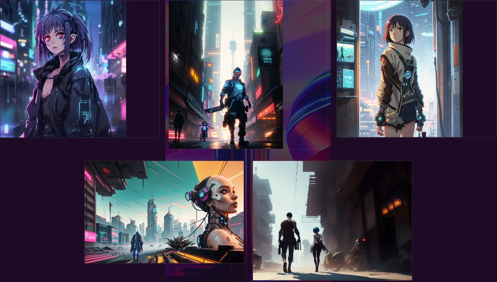

# GAS: Generative AI Story

🚀 As part of the MERIN UX/UI internship for C-10, this project introduces students to the realm of generative AI, combining it with animation morphing techniques to empower them in crafting dynamic and interactive user experiences.

 

## Website
* 👉 [jsohndata.github.io/gas-generative-ai-story](https://jsohndata.github.io/gas-generative-ai-story/)